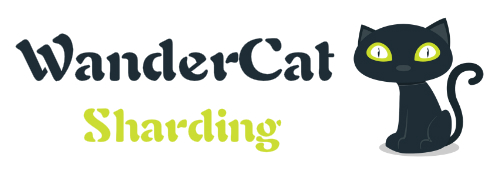

# WanderCat-Sharding

    

WanderCat-Sharding is an smart but not simple distributed database middleware, as a JDBC driver extension. WanderCat-Sharding is considered as a micro-service-oriented java library, which provides sharding databases and tables, read/write splitting, and distributed sequence features, also provides the distributed transaction.

# Feature
- smart but not simple
WanderCat-Sharding uses the simplest way of implementation, and the code is easy to understand.

- detailed documentation
I'll document the key techniques, including distributed transactions, data sharding strategies, distributed ID generation policies, SQL routing, SQL syntax parsing, and so on.

- row-level data migration is avoided
Database expansion only requires table-level data migration, avoiding row-level data migration, thus greatly reducing the cost of data migration.

- distributed transaction
Distributed transaction using best efforts 1pc. The final consistency of data is realized under the premise of guaranteed performance.

- low maintenance cost
It is simply a JDBC driver extension, not a database proxy, so no additional deployment is required, simple to use.

# License
This project is licensed under the Apache License 2.0 License - see the [LICENSE.md](https://github.com/bz51/wandercat-sharding/blob/master/LICENSE) file for details

